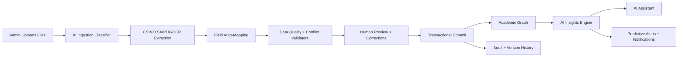

# AI Education OS Architecture

## Product North Star

StudentManagement is evolving from a student portal into a multi-tenant education operating system: a single platform for ingestion, academic records, attendance, timetable operations, analytics, parent communication, and AI-guided decision support.

The system should stay API-first and modular so the current Spring Boot application can keep serving production users while React/Next.js, mobile clients, AI workers, OCR services, and analytics warehouses attach around stable contracts.

## Roles

Primary access roles:

- `SUPER_ADMIN`: platform owner, tenant lifecycle, billing, global observability.
- `INSTITUTE_ADMIN`: institute operations, uploads, users, academic setup, exports.
- `PRINCIPAL`: leadership dashboard, approvals, interventions, reports.
- `COORDINATOR`: class, batch, timetable, attendance, and teacher workflow management.
- `TEACHER`: attendance, marks, assignments, class analytics, intervention notes.
- `STUDENT`: profile, timetable, attendance, scores, study plans, tasks.
- `PARENT`: attendance, progress, fee notices, report cards, meeting summaries.

The current codebase has `ADMIN`, `TEACHER`, and `STUDENT`. The target model should extend this via permissions instead of hard-coding role checks in business logic.

## Platform Modules

1. Identity and Tenant Core
   - Tenant, campus, academic year, departments, classes, batches, sections.
   - RBAC permissions, audit trails, first-login enforcement, rate limiting.

2. Smart Data Ingestion
   - Upload CSV, Excel, PDF, images, scanned sheets, handwritten attendance, marksheet photos, timetable screenshots, and ZIP bundles.
   - Detect document type, extract headers/text, infer canonical fields, validate row risks, create preview jobs, then commit with rollback.
   - Store every ingestion event with source fingerprint, actor, tenant, confidence, mapping decisions, warnings, and applied changes.

3. Academic Graph
   - Student, teacher, parent, subject, class, batch, semester, exam, timetable, fee, document, certificate.
   - Every record links to tenant, academic year, source upload, version, and audit actor.

4. AI Insights Engine
   - Deterministic analytics first: attendance %, marks trends, correlations, outliers, ranking, risk scoring.
   - LLM layer second: summaries, recommendations, parent-friendly language, teacher action plans.
   - Vector layer: semantic search over students, documents, announcements, notes, and reports.

5. AI Assistant
   - Natural language routes into safe intents: analytics queries, student search, report generation, timetable draft generation, upload help.
   - Mutating actions require preview, confirmation, audit log, and permission checks.

6. Timetable Intelligence
   - Conflict detection, teacher availability, classroom allocation, recurring sessions, holidays, exam scheduling, workload balance.
   - AI generator proposes drafts; deterministic validators remain source of truth.

7. Experience Layer
   - Admin SaaS shell, React analytics portal, teacher quick workflows, student/parent portals, mobile-ready APIs.
   - Dark/light mode, responsive layouts, skeleton states, real-time widgets, and action-oriented insight cards.

## Data Flow

## API Contracts Added In This Slice

- `POST /api/admin/ai-ingestion/analyze`
  - Classifies files, extracts lightweight headers, proposes schema mappings, and returns validation warnings.

- `POST /api/ai/assistant/command`
  - Converts natural language into a safe platform intent with endpoint suggestions, filters, confidence, and confirmation requirements.

These are intentionally preview-only contracts. They do not mutate academic records yet, which keeps the first integration safe.

## Production Hardening Checklist

- Replace heuristic ingestion with queued workers for OCR and LLM parsing.
- Add object storage for source files and generated artifacts.
- Add `pgvector` or a managed vector store for semantic search.
- Add row-level tenant isolation tests for every repository query.
- Add idempotency keys and source-file hashes for all imports.
- Add OpenTelemetry traces for uploads, AI calls, and timetable generation.
- Add async notification channels: email, SMS, push, WhatsApp adapter.
- Add feature flags for AI workflows by tenant and role.
