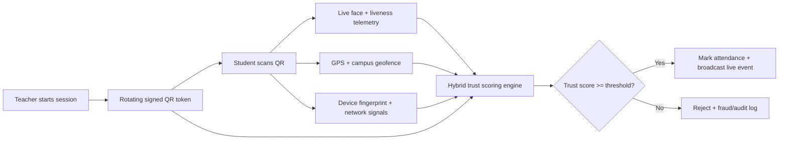

# Smart Attendance Verification Architecture

## Goal

StudentOS attendance must behave like a biometric trust system, not a basic QR scanner. The backend treats the client as untrusted and approves attendance only after combining dynamic QR validity, face identity, liveness, location, device intelligence, and behavioral fraud signals.

## Verification Pipeline

## Signals

- QR trust: JWT signature, token type, session id, expiry, freshness, token hash replay guard.
- Face trust: encrypted registered embedding, ArcFace/FaceNet similarity, Redis embedding cache.
- Liveness trust: blink, head movement, frame count, parallax, brightness variance, frame embedding motion, liveness-v2 anti-spoof fusion.
- Location trust: campus geofence, teacher QR origin distance, GPS accuracy, impossible movement, optional IP/GPS mismatch.
- Device trust: fingerprint, user agent, IP, client device id, device sharing detection, mock-location metadata when clients provide it.
- Behavioral trust: rapid attempts, repeated face failures, scan timing, group coordinate clustering, previous fraud logs.

## Runtime Components

- Spring Boot API: QR/session validation, RBAC, transactional attendance writes, audit, fraud logs, WebSocket events.
- Python ML API: ArcFace `buffalo_l` embeddings and liveness-v2 fusion.
- Redis: embedding cache, live analytics fanout, future QR nonce/session cache.
- Database: attendance, security audit, fraud logs, campus locations, student locations, face embeddings, telemetry tables.
- Edge/mobile client: camera capture, WebRTC/frame telemetry, GPS, device metadata, offline retry buffer.

## New Contracts In This Slice

- `HybridAttendanceTrustService`
  - Produces final score, component scores, approval decision, and rejection reasons.

- `MarkAttendanceRequest` telemetry additions
  - WiFi hash, beacon ids, mock-location flag, emulator/root flags, VPN/client risk flags.

- `MarkAttendanceResponse` trust additions
  - Final trust score and per-signal scores for teacher dashboards and student feedback.

## Approval Policy

Default approval threshold is `82`.

Hard failures still reject immediately:

- Invalid or expired QR.
- Missing location.
- Face mismatch or liveness failure when face verification is required.
- Outside classroom/campus radius.
- VPN/proxy detected when configured as blocking.
- Impossible movement.

The hybrid score blocks borderline fraud that passes individual checks but has weak combined trust.

## Scale Path

- Keep QR generation stateless but add Redis nonce/session registry for 5-10 second dynamic rotation at high concurrency.
- Move liveness/image inference behind GPU autoscaled Python workers.
- Publish scan attempts to Kafka/RabbitMQ for async anomaly analytics.
- Materialize attendance heatmaps and fraud trends into an analytics warehouse.
- Store raw camera frames only transiently in memory; persist encrypted embeddings and model metadata, not raw face images.
